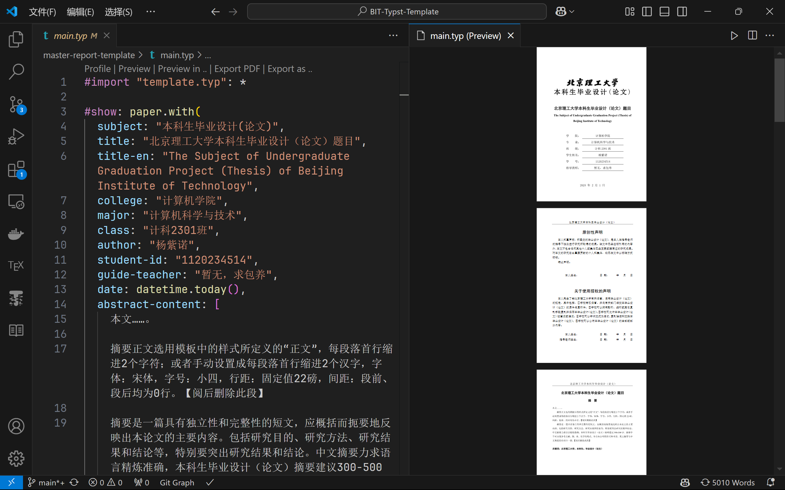
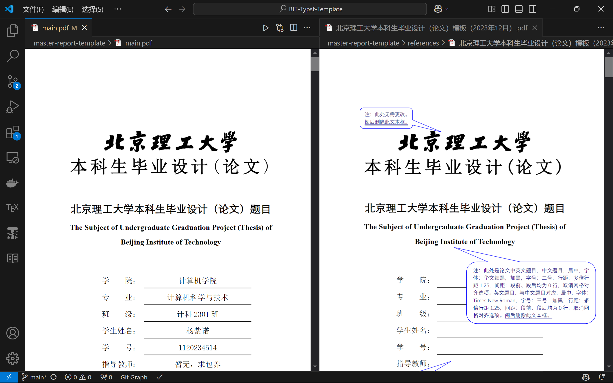
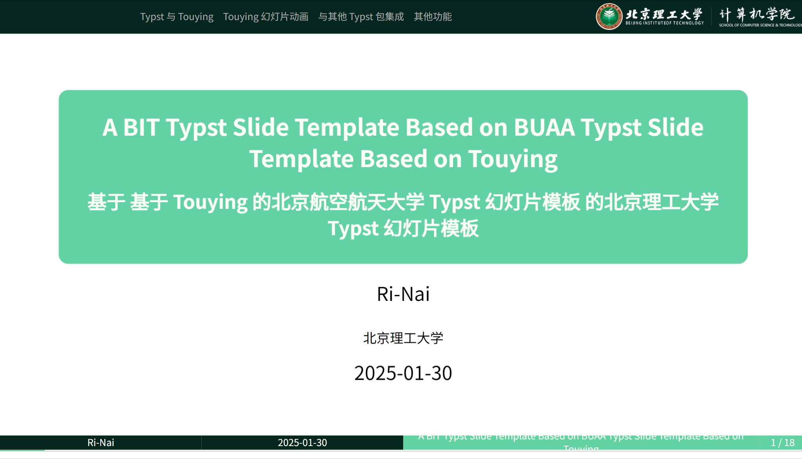

# 📝 BIT-Typst-Template

## 📚 毕业设计（论文）模板项目简介

### 📋 项目简介

在寒假闲着没事制作的非官方 BIT 本科毕业设计（论文）模板，基于 [2024 年本科毕业设计（论文）检测、评阅、抽检及答辩工作通知](https://jwb.bit.edu.cn//tzgg/026420854e704c86a2790948f6dc7034.htm) 的附件 Word 模板改编而成。





可以在 [GitHub Actions](https://github.com/Ri-Nai/BIT-Typst-Template/actions/workflows/build.yml) 中查看最新的 PDF 输出。

<!-- 或者在 [Releases](https://github.com/Ri-Nai/BIT-Typst-Template/releases) 中下载 -->

> [!CAUTION]
> 本模板不保证完全符合学校要求，使用时请自行检查是否符合。 <br>
> 本人目前就读大二，对毕业设计了解有限，模板为个人制作，可能存在不准确之处。 <br>
> 模板格式调整主要通过叠加透明图片进行微调，没有理论支持，仅为了模仿 Word 的排版效果。Word 和 Typst 的排版模型有差异，无法直接对比。

> [!NOTE]
> 已完成部分包括：封面、原创性声明、摘要、目录、正文、参考文献、附录、致谢。 <br>
> 模板中已加入三线表，可以在正文中使用。 <br>
> 目前未导入伪代码模块，代码格式为默认样式。 <br>
> 有序和无序列表格式未作调整，仍为默认样式。（因有序列表视觉效果不佳）

### 🛠️ 运行环境

💻 Typst 0.13.0

### 🚀 使用方法

#### 💾 安装 Typst

1. 通过 [GitHub release](https://github.com/typst/typst/releases) 下载
2. 使用包管理器安装：

   ```sh
   cargo install --locked typst-cli
   choco install typst
   winget install typst
   ...
   ```

#### 📖 使用模板

将项目下载到本地后，用 `VSCode` 和 [`Tinymist`](https://Myriad-Dreamin.github.io/tinymist) 插件打开。可按照 [`main.typ`](https://github.com/Ri-Nai/BIT-Typst-Template/blob/main/master-report-template/main.typ) 格式进行写作：

```typst
#import "template.typ": *

#show paper.with(
  ...
)

... // 你的正文内容

#references("./ref.bib")

#appendices()[]

#acknowledgements()[]
```

### ❗ 目前存在的问题

#### 📚 引用格式

目前使用的 `Typst` 内置的 `gb-7714-2015-numeric` 引用格式与学校要求的格式略有差异。通过 [zotero-chinese/styles](https://github.com/zotero-chinese/styles/blob/main/src/beijing-institute-of-technology/beijing-institute-of-technology.csl) 下载的 `csl` 文件可能效果好些，不过仍未完全满足 Word 中的格式。

据 https://github.com/BITNP/BIThesis/discussions/401#discussioncomment-8198542 反馈，本科生毕业设计（论文）的参考文献格式要求就是 `GB/T 7714-2015`，不需要特别的格式。

#### 🔤 字体格式

1. 模板中未包含 <span style="font-family: STXihei">STXihei</span> 字体（即 <span style="font-family: STXihei">华文细黑</span>）。大部分 Windows 电脑自带此字体，仅在封面主标题中使用。
2. Word 模板要求标题使用 <span style="font-family: 黑体">黑体</span>，正文和目录使用 <span style="font-family: 宋体">宋体</span>。借鉴 [BIThesis](https://bithesis.bitnp.net/) 的设置，我对所有拉丁字符（[a-zA-Z0-9]）使用 <span style="font-family: Times New Roman">Times New Roman</span>，以确保统一性。

#### 📝 原创性声明

该页直接采用导入 `SVG` 图片的方式实现，因为 Typst 无法完全匹配 Word 中的样式，故未采用其原生方式。

### 🙏 参考和致谢

- 感谢 [Typst](https://github.com/typst/typst) 项目开发者提供如此优秀的排版工具。
- 感谢 [Tinymist](https://github.com/Myriad-Dreamin/tinymist) 提供的 VSCode 插件，极大提升了 Typst 的使用体验。
- 感谢 Typst 中文社区的各位大佬，提供了很多有用的信息和帮助。
- 感谢 [BIThesis](https://bithesis.bitnp.net/) 项目及维护者，尽管我看不懂 $\LaTeX$，但该项目为我提供了很多启发和动力。
- 感谢 [HUST-typst-template](https://github.com/werifu/HUST-typst-template/) 项目及维护者，该模板为我的制作提供了宝贵参考。
  - 寒假期间使用该模板完成了数据结构研学报告，特别感谢维护者。
- 感谢 [zotero-chinese/styles](https://github.com/zotero-chinese/styles) 提供的引用样式，尽管无法直接使用。
- 感谢 [PixPin](https://www.pixpin.cn/) 这款截图与贴图工具，帮助我对模板格式进行精确调整。
---

## 🎭 slides-template

此为我在制作[数据结构-研学报告](https://github.com/Ri-Nai/BIT-Lexue-Code/blob/main/Data-Structure/Research-Report/1120231313-%E6%B1%87%E6%8A%A5.typ) 时使用的 Slides 模板，完全基于 [touying-buaa](https://github.com/Coekjan/touying-buaa) 项目。



欢迎支持原作者，给项目点个 Star。
## ✨ 关于 Typst

如果你看腻了 Word 和 $\LaTeX$，不妨试试 Typst，它可能会给你带来不一样的体验。

有类似于 `markdown` / `python` 简单的语法，又有 $\LaTeX$ 强大的排版功能，是一款非常适合学术写作的工具。


- Typst 官方网站：[https://typst.app/]
- Typst GitHub 仓库：[https://github.com/typst/typst]
- Typst 小蓝书：[https://typst-doc-cn.github.io/tutorial/]
- Typst 中文社区导航：[https://typst-doc-cn.github.io/guide/]
- Typst 中文非官方交流群：793548390
